# fast-filters
Implementation of FIR and IIR filters optimized for SIMD processing

## Benchmarks

The following benchmarks have been computed on x86_64 Linux with Intel(R) Core(TM) i7-6500U CPU @ 2.50GHz.

| AVX single precision                               | AVX double precision                                 |
| -------------------------------------------------- | ---------------------------------------------------- |
| 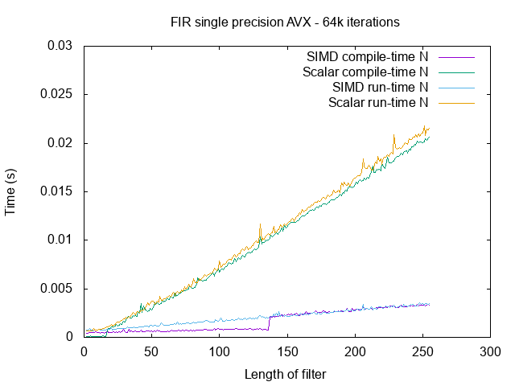 | 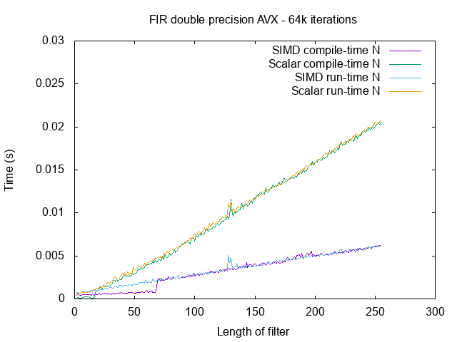 |
| 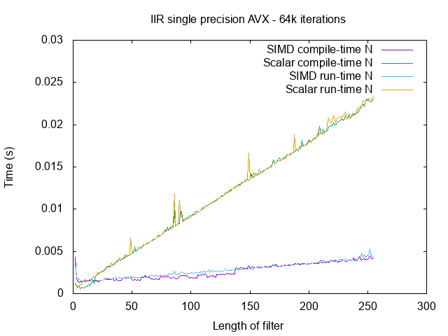 | 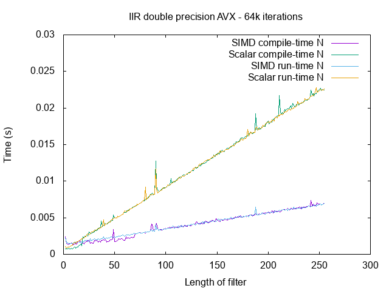 |

| SSE single precision                               | SSE double precision                                 |
| -------------------------------------------------- | ---------------------------------------------------- |
| 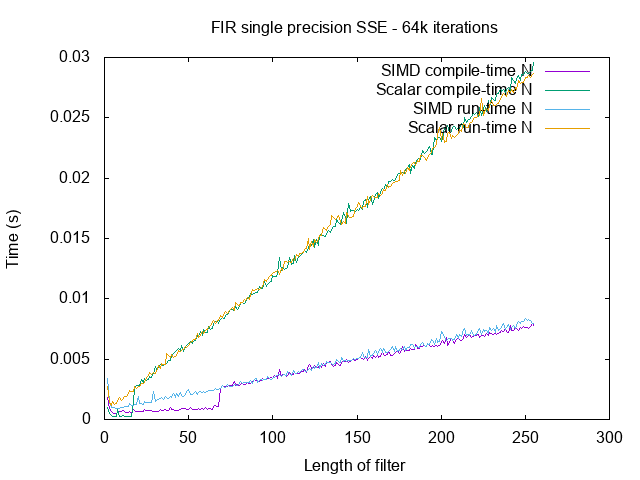 | 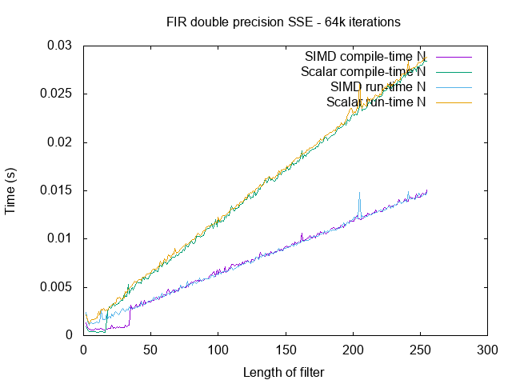 |
| 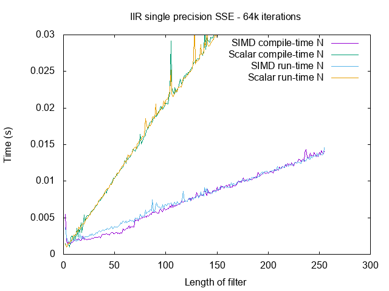 | 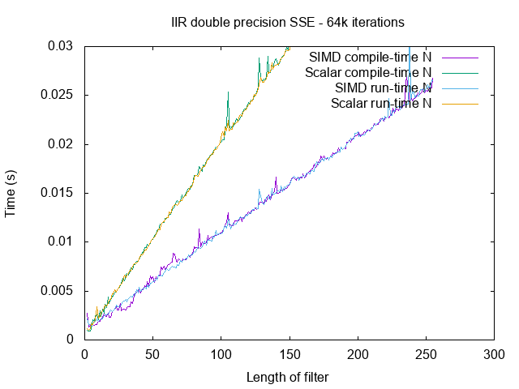 |

The following benchmarks have been computed on aarch64 Linux with Odroid-C2.

| A64 single precision                               | A64 double precision                                 |
| -------------------------------------------------- | ---------------------------------------------------- |
| 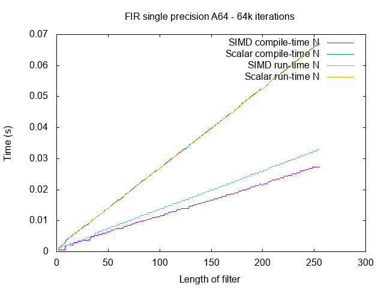 |  |
| 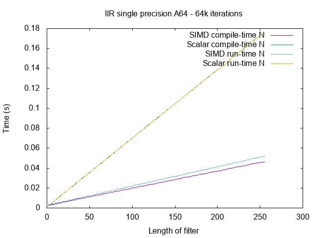 | 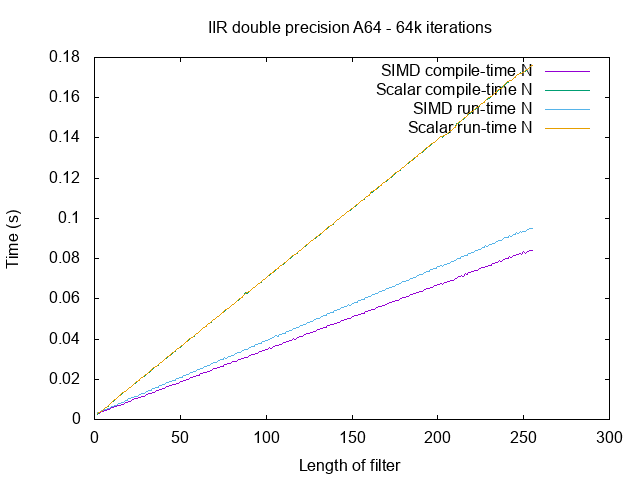 |
